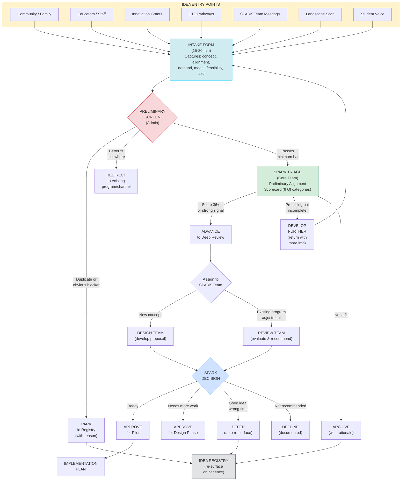

# SPARK Intake Process Flow

> **Visual process map** — can be rendered with any Mermaid-compatible viewer (GitHub, VS Code plugin, mermaid.live, etc.)

## Process Timing

| Stage | Cadence | Duration |
|---|---|---|
| Idea Capture | Continuous (always open) | — |
| Preliminary Screen | Within 2 weeks of submission | 15-30 min per idea |
| SPARK Triage | Quarterly (or as-needed for urgent concepts) | 15-30 min per idea |
| Deep Review | As assigned (Design/Review team schedule) | 4-8 weeks |
| Decision | Quarterly SPARK meeting | — |

## Key: How Ms. Mitchell's "Process Flow" Vision Maps Here

Ms. Mitchell envisioned "a graphic or flow chart that would ultimately be on a forward-facing website where people would be able to see the process visually and access the more detailed information."

This flow chart serves as the backbone. The interactive web mockup (`mockup/index.html`) demonstrates how this could work as a clickable, public-facing experience where:
- A person with a **new idea** clicks "Submit an Idea" and lands on the Intake Form
- A person curious about **what's in the pipeline** clicks "View Idea Registry"
- A person wanting to **learn about existing programs** clicks "Current Programs"
- A SPARK team member clicks "Triage Dashboard" for internal tools

---
*SPARK Intake Process Flow v1.0 — March 2026*
